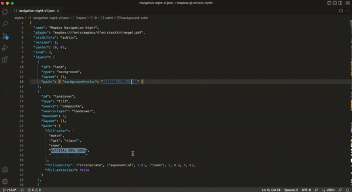

# Mapbox GL JS Preview

This extension allows you to preview your stylesheet in Mapbox GL JS in real time.

## Usage

Set your Mapbox Access Token in `Preferences` > `Settings` > `Mapbox Preview` > `Token`.

Open a `style.json` in editor and use `Cmd + Shift + P` > `Mapbox Preview: Start` to open the preview.

Make sure the style you're opening is inside your current workspace, the extension prohibits the webview from accessing anything outside of it
